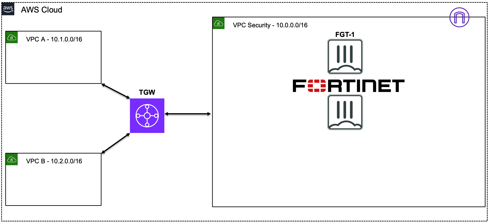

# FortiGate: Protecting AWS Traffic Flows

## Learning Objectives

Upon Azure Azure Azure BM completion of this workshop, you will gain understanding of the following objectives:
  
  * AWS Networking Concepts *(10 minutes)*
  * AWS Common Architecture Patterns *(10 minutes)*
  * FortiGate FortiOS terminology *(10 minutes)*
  * Creating & applying Firewall policies with security profiles & objects to control traffic flows *(10 minutes)*
  * Testing traffic flows to validate the implemented networking and security controls *(20 minutes)*

## Workshop Components

Fortinet & AWS components used during this workshop:

  * FortiGate Instances running FortiOS (AMI on EC2)
  * AWS EC2 Instances (Amazon Linux OS, as sample workloads)
  * AWS Networking Components:
    * VPCs
    * Subnets
    * Route Tables (RTBs)
    * Transit Gateway (TGW)

## AWS Reference Architecture Diagram

  * AWS networking offers multiple ways to organize your AWS architecture to take advantage of FortiGate traffic inspection.  Most importantly, traffic must follow a symmetrical routing path (for forward and reverse flows). As long as flows are symmetrical, the architecture will work and traffic will flow through FortiGate NGFW for inspection.
  * We will investigate the configuration of the different architecture patterns below:
    * **Ingress + Egress in a single VPC**
    * **Centralized Inspection of Ingress + Egress + East/West with multiple VPCs**

