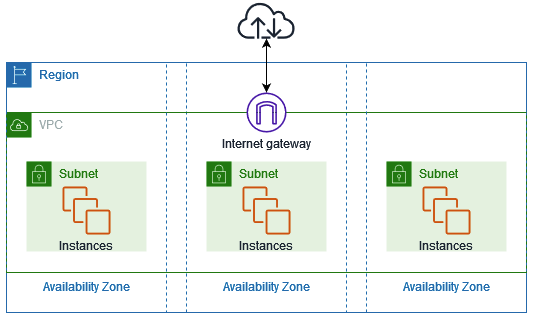

### AWS Network Routing
  - AWS networking is [**Software Defined Networking**](https://www.vmware.com/topics/glossary/content/software-defined-networking.html.html) where VPCs have a built-in or implicit router
  - VPC Route Tables (RT) are similar to static routes in traditional routing
    - Generally they are attached to a subnet impacting the destination routing decisions for that subnet only
    - Putting the pieces together, AWS routing decisions happen at every hop along the traffic path
      {} 

Symmetrical paths are the most important rule for AWS routing
  - Traffic must follow the same path in the outbound and inbound direction

     {}
    - Sometimes RT can be associated with services (like IGW) allowing special routing decisions in specific scenarios
  - Every VPC has a default RT which allows communication between all subnets in the VPC
    - Every newly created subnet is associated with this default RT
    - you cannot change the VPC CIDR route entry in the default RT
    - You can add more specific subnet routes to a RT to do things like FortiGate NGFW Inspection of traffic _BETWEEN Subnets_ in a VPC

### AWS Networking Services

Before diving into the reference architecture for this workshop, let's review core AWS networking concepts. **Click the hyperlinks for AWS documentation**.

Service Name | Defined by                               | Limitations | Affinity
--- |------------------------------------------|-------------| ---
VPC | CIDR block (can add multiple CIDR blocks) | CIDR block between /16 and /28 | lives in 1 region
Region| Large geographical area | isolated from other regions (which can be connected with TGW) | can have many VPCs
Availability Zone | generally 1 physical datacenter/MAN | power, cooling, and networking are shared in an AZ | each region has multiple AZ's
Subnet | IP subnet of the VPC's CIDR definition | CIDR block between /16 and /28 | belongs to 1 VPC and 1 AZ only
IGW | | VPC Route Tables (RTBs) can be associated to IGW to influence routing beyond subnet (advanced scenario) | belongs to 1 VPC
NATGW | 1 (or more) EIPs | outbound traffic only | belongs to 1 subnet(AZ)
EIP | single Public IP address | belongs to a region | attachment to EC2, NLB/ALB, NATGW
--- | --- | --- | ---
VPC Peering | peering connection specifying 2 VPCs only | no transitive routing | routing path between 2 VPCs only (legacy)
TGW | TGW routing tables, VPC, VPN, DXC and other attachments | 5,000 attachments per transit gateway | belongs to 1 region

### AWS Networking Base Services
- [**Virtual Private Cloud (VPC)**](https://docs.aws.amazon.com/vpc/latest/userguide/how-it-works.html) is a logically isolated section of the AWS Cloud where you can launch AWS resources in a virtual network that you define. You have complete control over your virtual networking environment, including selection of your own IP address range, creation of subnets, and configuration of route tables and network gateways.
- [**Region**](https://docs.aws.amazon.com/AWSEC2/latest/UserGuide/using-regions-availability-zones.html#concepts-regions) is a collection of multiple Availability Zones in a geographic location. The collection of AZs in the same region are all interconnected via redundant, ultra-low-latency networks.
- [**Availability Zones (AZ)**](https://docs.aws.amazon.com/AWSEC2/latest/UserGuide/using-regions-availability-zones.html#concepts-availability-zones) are multiple, isolated datacenter locations within each Region that have independent power, cooling, physical security, etc. A VPC spans all of the AZs in the Region. 
- All [**subnets**](https://docs.aws.amazon.com/vpc/latest/userguide/configure-subnets.html) within a VPC are able to reach each other with the default or intrinsic router within the VPC. All resources in a subnet use the intrinsic router (1st host IP in each subnet) as the default gateway. Each subnet must be associated with a VPC route table, which specifies the allowed routes for outbound traffic leaving the subnet. Subnets are tied to a single AZ.
- [**Internet Gateway (IGW)**](https://docs.aws.amazon.com/vpc/latest/userguide/VPC_Internet_Gateway.html) is a horizontally scaled, redundant, and highly available VPC component that allows communication between instances in your VPC and the internet. It therefore imposes no availability risks or bandwidth constraints on your network traffic.
- [**Elastic IP (EIP)**](https://docs.aws.amazon.com/vpc/latest/userguide/vpc-eips.html) is a static IPv4 address designed for dynamic cloud computing within a region. Simply allocate one to a region in your account and associate this to an EC2 instance to access it over the public internet.[**NAT Gateway (NAT GW)**](https://docs.aws.amazon.com/vpc/latest/userguide/vpc-nat-gateway.html) is a Network Address Translation (NAT) service. You can use a NAT gateway so that instances in a private subnet can connect to services outside your VPC but external services cannot initiate a connection with those instances.

  

### AWS Network Connectivity Services
- [**VPC Peering**](https://docs.aws.amazon.com/vpc/latest/peering/vpc-peering-basics.html) is a private and point to point connection between two VPCs. While you can connect many VPCs together in the same region, **VPC peering does not support transitive routing**. In the diagram below, VPC A has peering connections to both VPC B & C, so A can talk to B or C. However, VPC B can't talk to VPC C, and the reverse as well, unless you setup a VPC peering connection directly between them. As VPCs scale, it is better to use Transit Gateway instead.
  
- [**Transit Gateway (TGW)**](https://docs.aws.amazon.com/vpc/latest/tgw/how-transit-gateways-work.html) is a highly scalable cloud router that connects your VPCs in the same region to each other, to on-premise networks, and even to the internet through one hub. With the use of multiple route tables for a single TGW, you can design hub and spoke routing for traffic inspection and enforcement of security policy across multiple VPCs. As the name implies, [**Transit Gateway supports transitive routing**](https://docs.aws.amazon.com/vpc/latest/tgw/TGW_Scenarios.html).
  

### AWS Data transfer cost considerations
Below is a simplified description of the most basic AWS networking & data transfer charges.  The listed costs are examples only and change frequently based on the region in use.  Please consult [**AWS documentation for costs of your specific scenario**](https://aws.amazon.com/blogs/architecture/overview-of-data-transfer-costs-for-common-architectures/)

{}

Any specific pricing listed below is for estimation purposes only.  Please reference the [**AWS Cost Calculator**](https://calculator.aws/#/) for the most up-to-date pricing for your infrastructure. 
{}

{}

Workshop participants running this workshop during a Fortinet event will not incur any AWS charges.

{}

Transfer description | cost ($)
--- | ---
Inbound (from Internet) | $0.00 (Free)
Outbound (to Internet) | $0.09/GB (volume discounts apply)
Within an AZ | $0.00 (Free)
Across AZs (within Region) | $0.01/GB
Across Regions | $0.01-0.02/GB
--- | ---
AWS Service costs | cost ($)
VPC Peering | $0.00 (Free)
TGW | [**See AWS TGW Pricing**](https://aws.amazon.com/transit-gateway/pricing/)
IGW | [**See AWS VPC Pricing**](https://aws.amazon.com/vpc/pricing/)
NATGW | [**See AWS VPC Pricing**](https://aws.amazon.com/vpc/pricing/) 
EIP | [**See AWS VPC Pricing**](https://aws.amazon.com/vpc/pricing/)

In this workshop we will use these components to highlight insertion of FortiGate NGFW into an enterprise architecture. 
