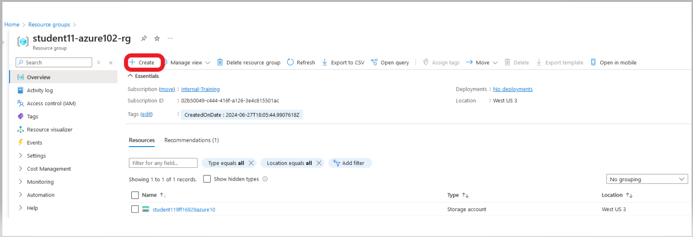
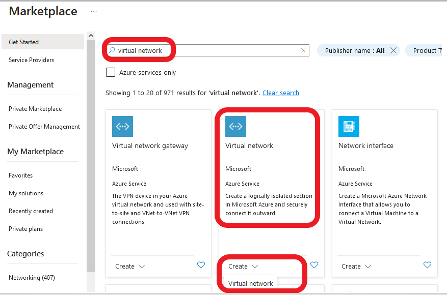
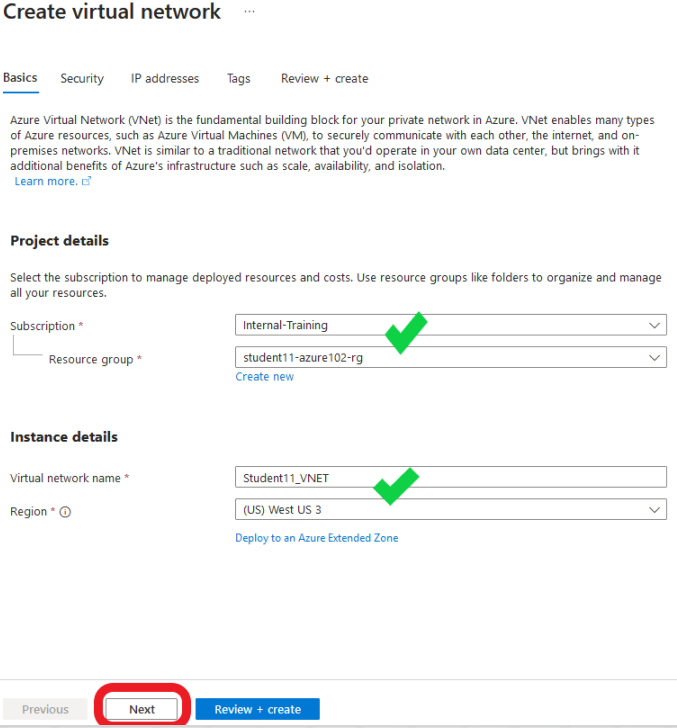

Our first step is going to be the creation of a new VNET (Virtual Network) in the training Resource Group that you have been assigned.
- **Creation Steps**
    - 1. Navigate into your Resource Group and click on the **+ Create** located at the top left of the tool bar.
  

You will be redirected to the Azure Marketplace.

In the Marketplace search bar, enter **Virtual Network** and then enter.  Navigate to the **Virtual Network** offering from Microsoft and select **Create** and **Virtual network**.

You will be redirected to the **Create virtual network** template.

- Under the **Basics** tab, the **Subscription** and **Resource Groups** should already be filled out with your assigned info.  If not, see the screen shot below for details.
- Under **Instance details**, enter the **Virtual network name**: "**Studentxx_VNET**".   
    - Replace "**xx**" with your assigned student number.
- Confirm the **Region** is <ins>**(US) West US 3**</ins>
- Select **Next**.

On the **Security** tab, make sure nothing is selected.  F