Now that you have a **VNET** deployed, you are going to deploy two Linux VMs in your VNET, identify assigned public IP (PIP), confirm access to the Internet, and confirm access to between each VM.

One VM, **Linux-A-VM**, will be assigned to the **Protected-A_Subnet**, and the second VM, **Linux-B-VM**, will be assigned to the **Protected-B_Subnet**.

**Steps to create Linux-A-VM**
- 1. Navigate into your Resource Group and click on the **+ Create** located at the top left of the tool bar.
  

You will be redirected to the Azure Marketplace.

- 2. In the Marketplace search bar, enter **ubuntu 24.04 lts** and then enter.  Navigate to the **Ubuntu 24.04 LTS - all plans including Ubuntu Pro** offering from **Canonical** and select **Create** and **Ubuntu Server 24.04 LTS**.
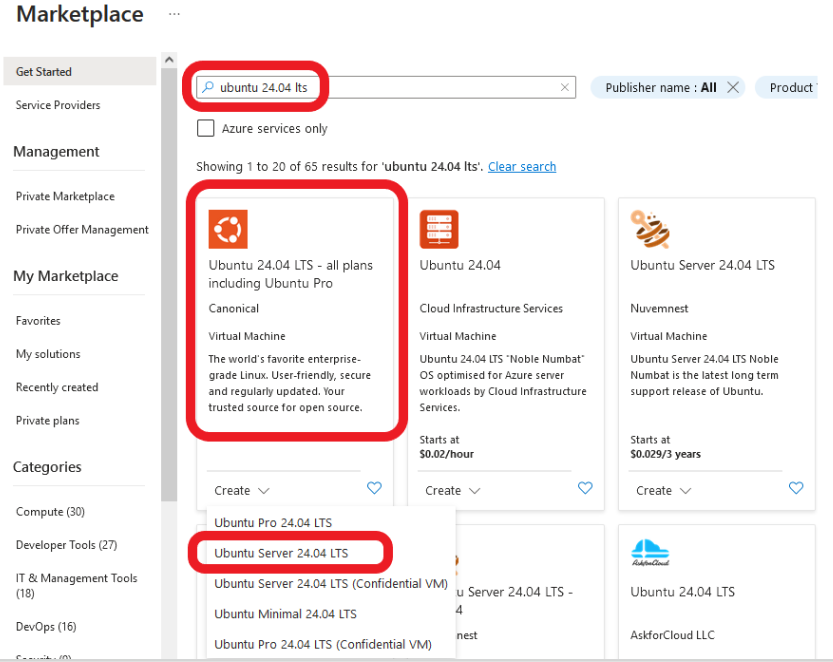

You will be redirected to the **Create a virtual machine** template.

- 3. Under the **Basics** tab, update the following fields:
(Leave the default entry of the other fields not listed here)
    - **Resource group**:  "**studentxx-azure102-rg**"
    - **Virtual machine name**:  "**Linux-A-VM**"
    - **Availability options**:  "**No infrastructure redundancy required**"
    - **Security type**:  "**Standard**"
    - **Size**:  Select "**See all sizes**"
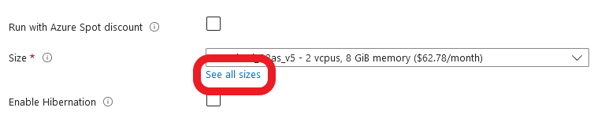
    - On the **Select a VM size** screen, expand the **D-Series v5** section and select "**D2as_v5**" and then click **Select**.
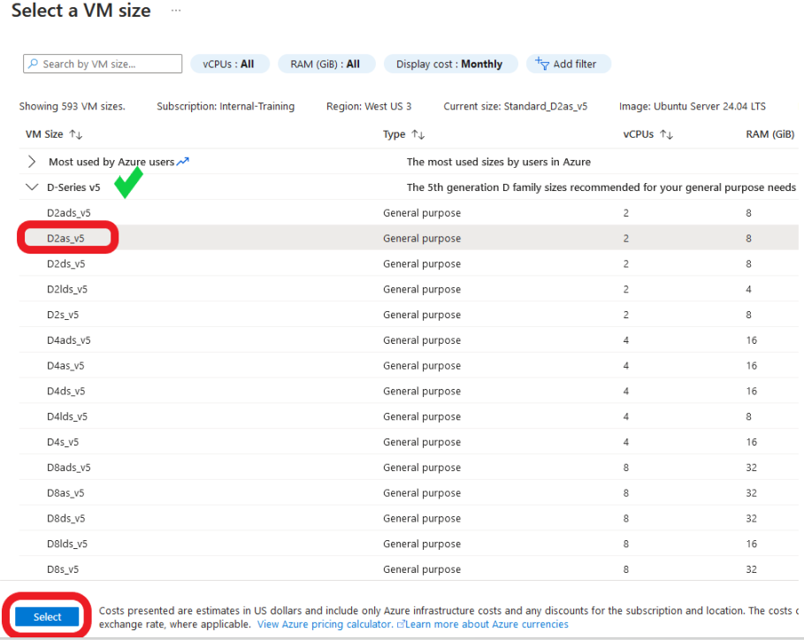
    
    - Continuing from the **Create a virtual machine** screen,
    - **Authentication type**:  "**Password**"
    - **Username**:  "**studentxx**"  (Replace xx with your student number)
    - **Password**:  "**FortinetAzure2024!**" (Same as your Azure portal login)
    - **Confirm password**:  "**FortinetAzure2024!**"

- 4. Confirm the changes and the other fields default entries match the following diagram.
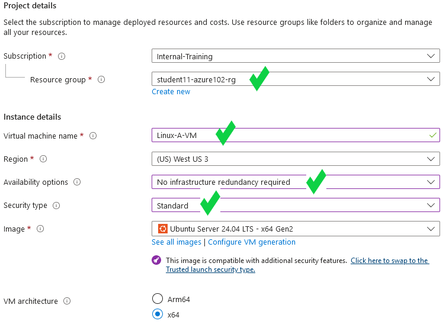
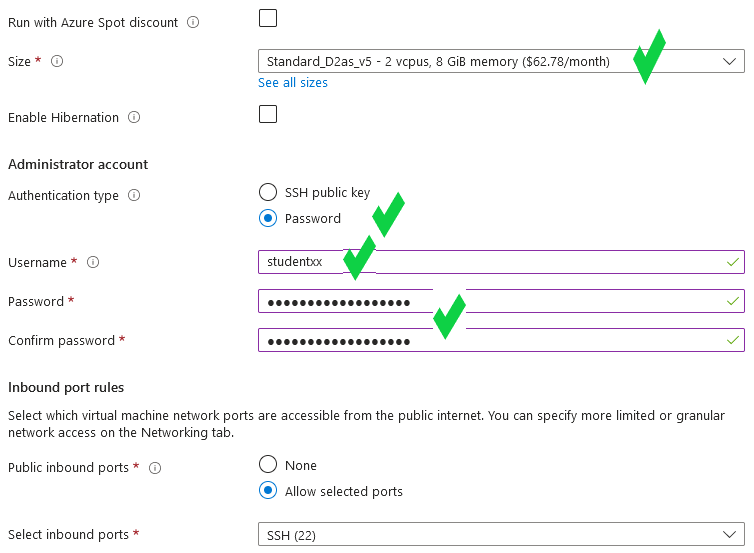
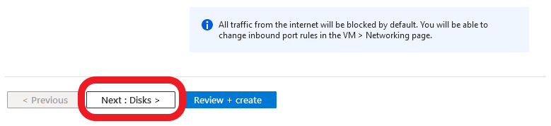

- 5. Select **Next: Disks >**.

- 6. On the **Disk** tab, keep the default settings and click **Next:Networking >**.
Feel free to read through the available disk services that can be changed/enabled.

- 7. Under the **Networking** tab, update the following fields:
(Leave the default entry of the other fields not listed here)
    - **Virtual network**:  "**Studentxx_VNET**"
    - **Subnet**:  "**Protected-A_Subnet (192.168.1.128/27)**"
    - **Public IP**:  Select **Create new**
        - On the new **Create public IP address** on the right, enter the following:
        - **Name**:  "**Linux-A-VM_PIP**"
        - **Routing preference**:  "**Internet**"
        - Select **OK**
    - **Delete public IP and NIC when VM is deleted**:  **Select**

- 8. Confirm the changes and the other fields default entries match the following diagram.
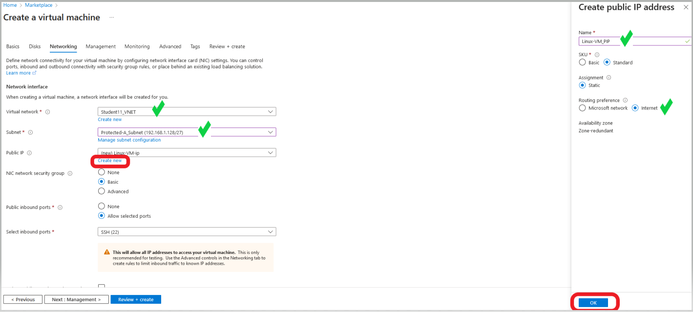
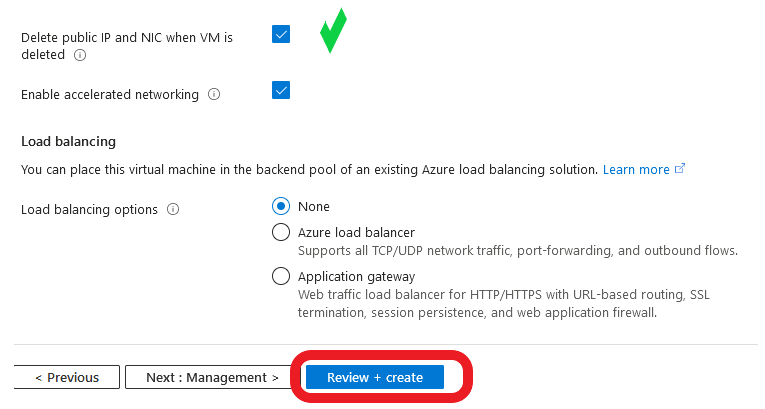

- 9. Select **Review + create >**.

- 10. Feel free to read through the **Management**, **Monitoring**, **Advanced**, and **Tags** tabs for additional services that can be changed/enabled.

- 11. Confirm the template validation has passed and select **Create**
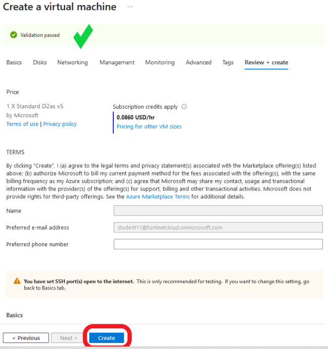

- 12. The **Deployment is in progress** notice is displayed.

- 13. Once the **Your deployment is complete** notice is displayed, click on the **student11-azure102-rg** link to be re-directed to your resource group.
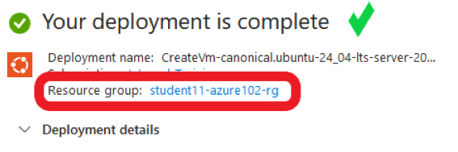

- 14. Verify the new **Linux-A-VM** and the associated componets are listed.
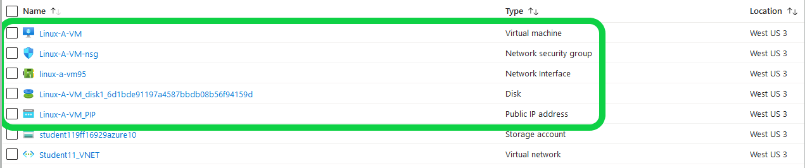

**Steps to create Linux-B-VM**
- 15. Follow the same 1-14 steps above to create the **Linux-B-VM**
    - You will need to alter the following where appropriate:
        -   - **Virtual machine name**:  "**Linux-B-VM**"
            - **Subnet**:  "**Protected-B_Subnet (192.168.1.160/27)**"
            - **Public IP**:  Select **Create new**
            - On the new **Create public IP address** on the right, enter the following:
            - **Name**:  "**Linux-B-VM_PIP**"

- 16. Verify the new **Linux-B-VM** and the associated componets are listed.
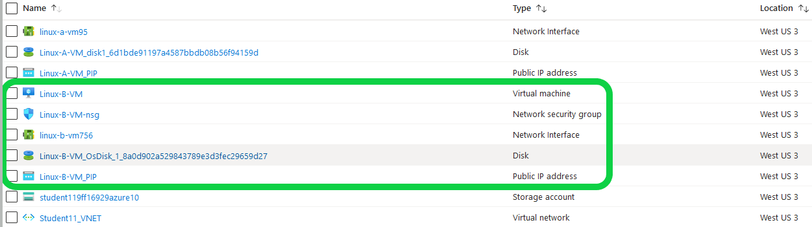

- Continue to **Task 3 - Confirm access to the Internet and assigned public IP (PIP).**

