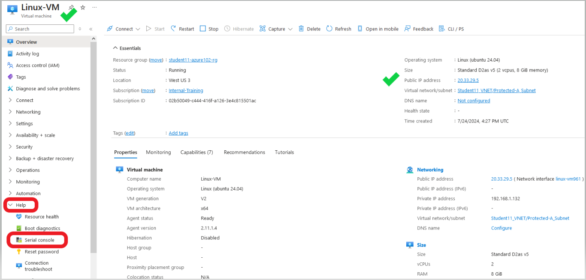
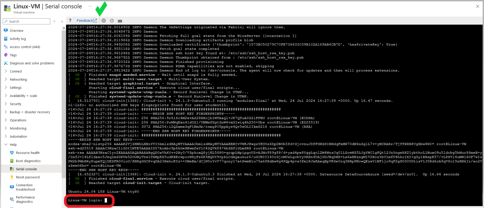

Now that you have created the virtual machine, **Linux-VM**, you are going to identify their assigned public IP (PIP), confirm access to the Internet, and connectivity between each VM via their assigned subnets.

 **Access the serial console of the virtual machine **Linux-A-VM**
- 1. Navigate into your Resource Group and click on the virtual machine **Linux-A-VM**.  
  
    
- You will be redirected to the **Linux-A-VM** Overview page.

- 2. Under the **Essentials** section, right hand side column, identify the assigned public IP of the **Linux-A_VM**
        - Navigate to the bottom left of the screen, expand the **Help** menu, and select **Serial Console**.

- You will be redirected to the **Linux-A-VM | Serial Console** screen.

- 3. Login to the **Linux-A-VM** console using the credentials you used when creating the **Linux-A-VM**.

- 4.  From the **Linux-A-VM** CLI, 