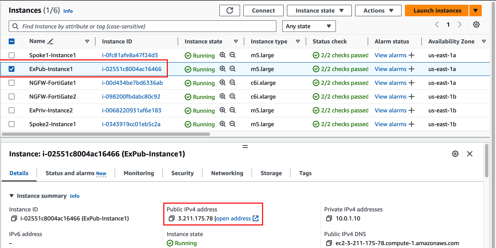
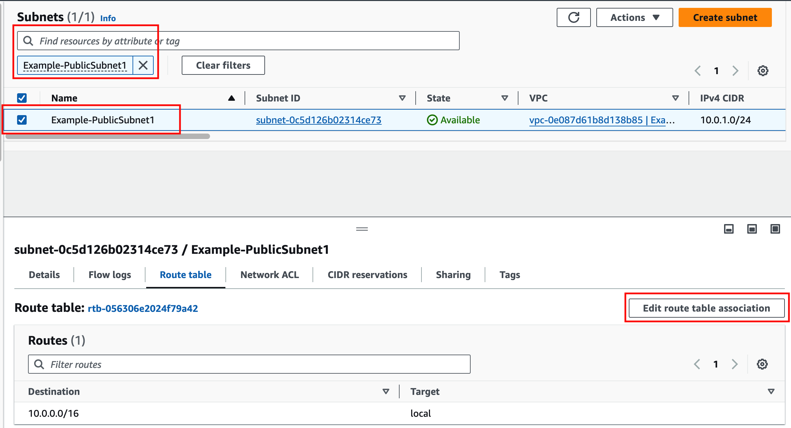
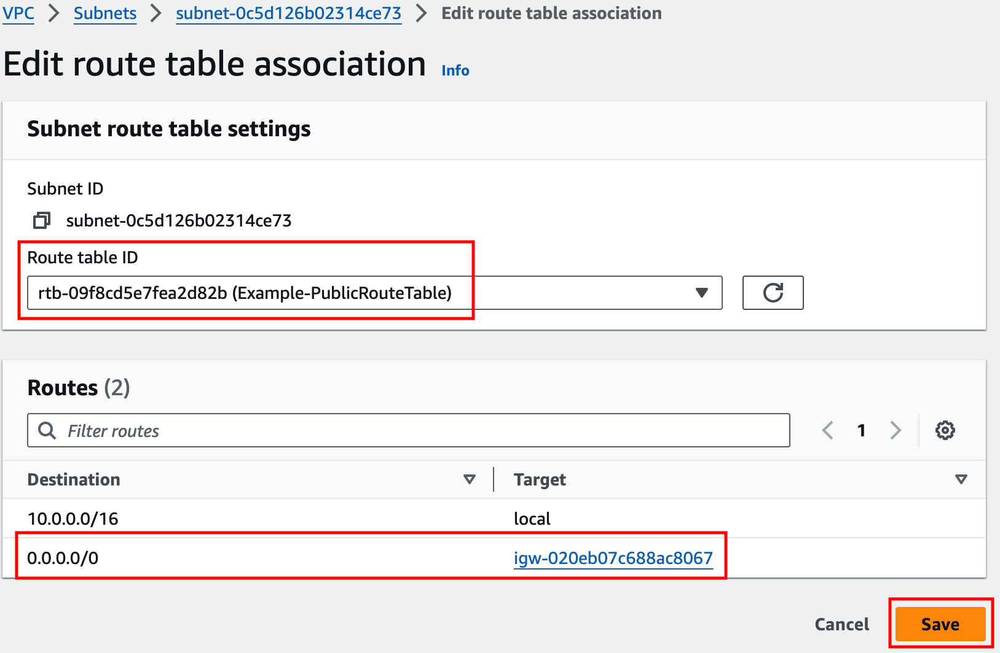
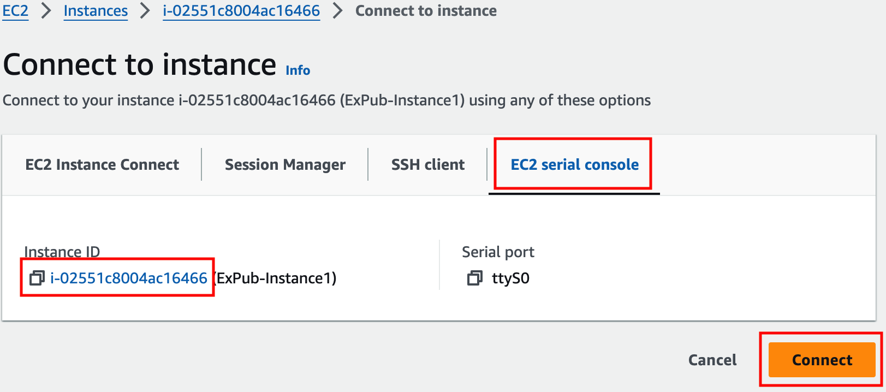
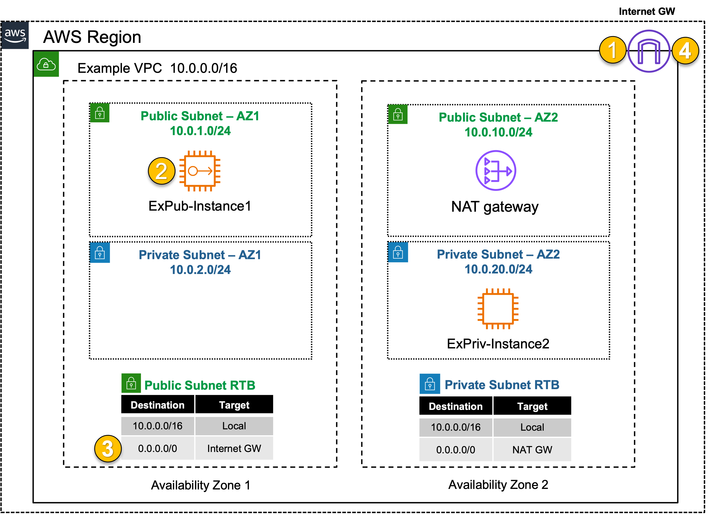

## **Public Inbound: Single VPC with IGW**
|                            |    |  
|----------------------------| ----
| **Goal**                   | Establish Internet access for EC2 Public instance (inbound + outbound).
| **Task**                   | Adjust the route table associations so you can ping ExPub-Instance1.
| **Verify task completion** | Confirm inbound VPC connectivity to EC2 Instance via Ping the EC2 Public instance from your laptop/workstation 

{} 

There are no security controls in this example. ExPub-Instance1 can freely communicate with the Internet and anybody on the Internet can reach ExPub-Instance1.

{}

#### Summarized Steps (click to expand each for details)

1. Find the EC2 Instance Public IP and verify it's currently inaccessible.

    {}

- **1.1:** In your AWS account, navigate to the **EC2 Console** and go to the **Instances page** (menu on the left).
- **1.2:** Find the **ExPub-Instance1** instance, and copy the **Public IP address**.
- **1.3:** In your command prompt or terminal, ping the **public IPv4 address** of the instance.
   - This **SHOULD NOT** work at this point.

    {}

2. Identify the route table and examine routes, then associate the route table to the proper subnet.

    {}

- **2.1:** Navigate to the **VPC Console** and go to the **Subnets page** (menu on the left).
- **2.2:** Find the **Example-PublicSubnet1** subnet & Select the **Route table tab**.
- **2.3:** Click **Edit route table association**.
- **2.4:** Select the **Example-PublicRouteTable** and click **save**.

  {}

3. Verify communication to the EC2 Instance Public IP. 

    {}

- **3.1:** Ping the Public IP/DNS of the EC2 instance from your (workstation).
- **3.2:** Browse **over HTTP** to the public IP of the EC2 instance from your (workstation).
  - Now you can successfully connect to the **public IPv4 address** of the **ExPub-Instance1** instance. 

  {}
    
If you are unable to access the instance webpage, you may need to disconnect from your corporate VPN or change your Web Filter settings to allow access. An upstream proxy or web filter is blocking access.

  {}
  
    {}

4. Let's dig deeper to understand how all of this works.
   - IGW implicit NAT on EC2 EIP's.

    {}

- **4.1:** In the **EC2 Console** go to the **Instances page** select the **ExPub-Instance1** instance.
- **4.2:** click **Connect > EC2 serial console**.
    - **Copy the instance ID** as this will be the username and click connect. 
  
- **4.3:** Login to the EC2 instance:
    - username: <<copied Instance ID from above>>
    - Password: **`FORTInet123!`** 
- **4.4:** Run the command **`ifconfig ens5`** and take note of the instance IPv4 address.
- **4.5:** Run the command **`curl ipinfo.io`**.

  {}
    
  The instance has the private IP 10.0.1.10/24, but is reachable by and seen as the associated public IP. This is because an [**Elastic IP (EIP)**](https://docs.aws.amazon.com/vpc/latest/userguide/vpc-eips.html) is a 1 to 1 NAT service provided by the [**AWS Internet Gateway (IGW)**](https://docs.aws.amazon.com/vpc/latest/userguide/VPC_Internet_Gateway.html).
    
  {}

- **4.6:** Run the command **`route -n`** and take note of the default route and the gateway IP for that route.

  {}

  The instance has a default route going to the private IP of 10.0.1.1. This is the AWS VPC router (aka intrinsic router), which is the first host IP in any subnet within a VPC. Reference this [**AWS document**](https://docs.aws.amazon.com/vpc/latest/userguide/subnet-sizing.html#subnet-sizing-ipv4) to learn what other IPs in a subnet are always used by AWS.

  {}
  
- **4.7:** The VPC route table that you assigned to the public subnet has a default route to the Internet through the AWS Internet Gateway (IGW). Also this instance has an Elastic IP (EIP), a public IP, associated to it. These AWS networking components are allowing the public in/outbound access to work successfully for this instance.
     
- **4.8** Below is a step by step of the packet handling for the inbound web traffic to ExPub-Instance1.

Hop | Component | Description | Packet |
---|---|---|---|
1 | Internet -> IGW | Inbound traffic destined to the EIP is received at the IGW. | **x.x.x.x:src-port -> y.y.y.y:80** |
2 | IGW -> ExPub-Instance1 | IGW changes the destination IP to the private IP of ExPub-Instance1. The VPC router will route traffic to ExPub-Instance1. | **x.x.x.x:src-port -> 10.0.1.10:80** |
3 | ExPub-Instance1 -> 0.0.0.0/0 IGW| ExPub-Instance1 receives the traffic, seeing the original public source IP, and replies. This traffic is sent to the VPC router (its default gw) which routes the traffic to the IGW as configured in the Example-PublicRouteTable. | **10.0.1.10:80 -> x.x.x.x:dst-port** |
4 | IGW -> Internet | IGW changes the source IP to the associated EIP of ExPub-Instance1 and routes the traffic to the internet. | **y.y.y.y:80 -> x.x.x.x:dst-port** |

  

    {}

### Discussion Points
- EC2 instances can be assigned an EIP for public reachability.
- VPC's must have an IGW associated to provide Internet access to any subnet in the VPC.
- Subnets have a default RTB associated to them upon creation, allowing default reachability between all subnets in the VPC. 
- You can create additional RTBs within a VPC, and then associate each RTB to one or more subnets, altering the routing behavior of ALL TRAFFIC within that subnet.
- This is a very basic setup and is often used as a "hello world" demo for intro to cloud. 
  - Without any additional actions taken, this EC2 instance is wide open to the Internet, meaning it can communicate freely to anywhere on the Internet and anybody on the Internet can communicate freely to it. As we'll see later, there are already inbound probing attempts against this instance even though it was just launched in the last 30 minutes.

**This concludes this task**
