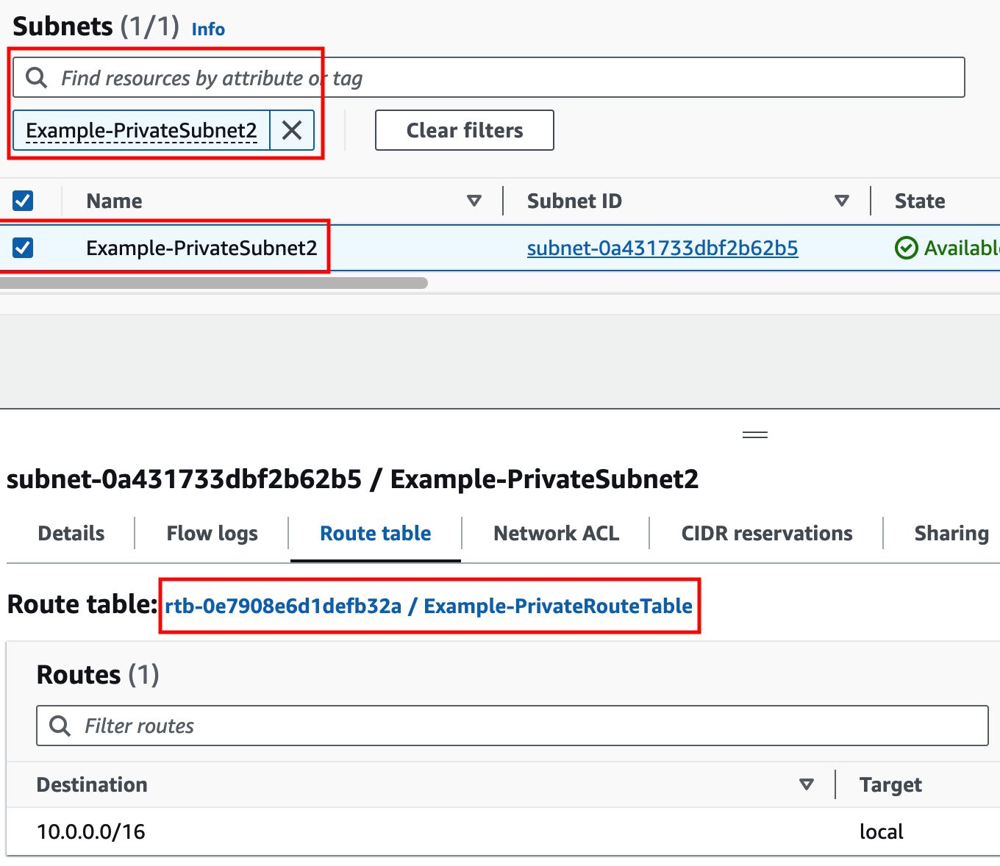
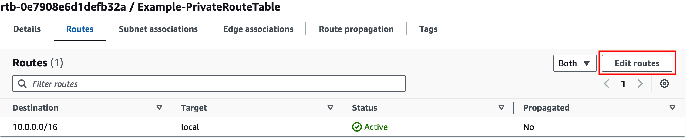
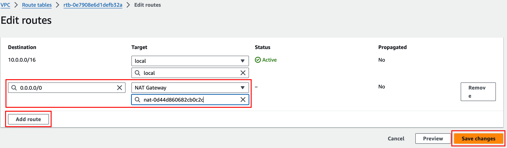
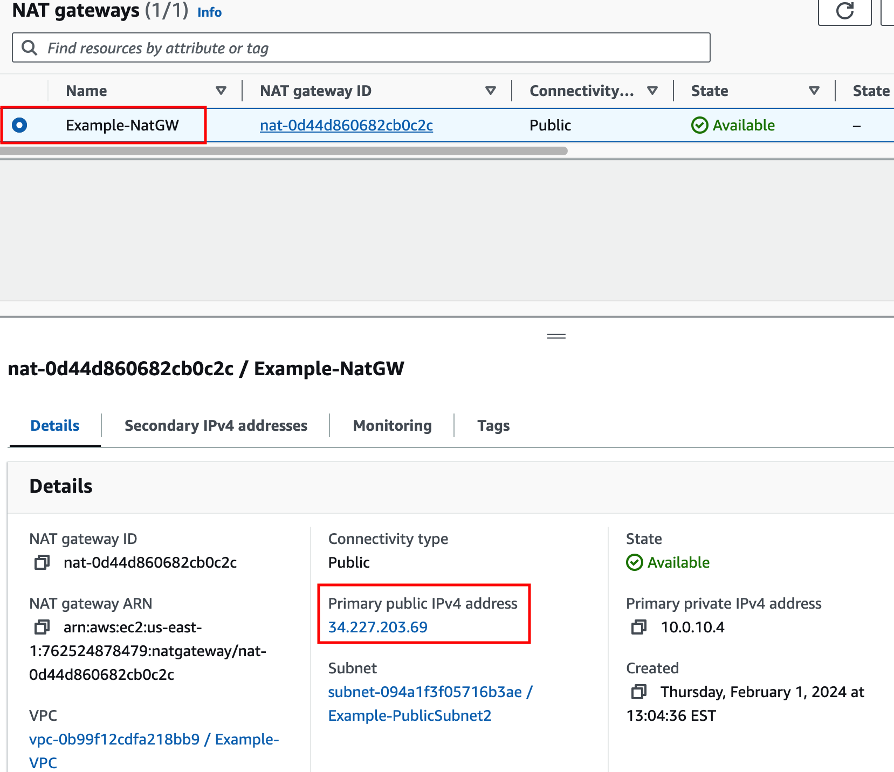
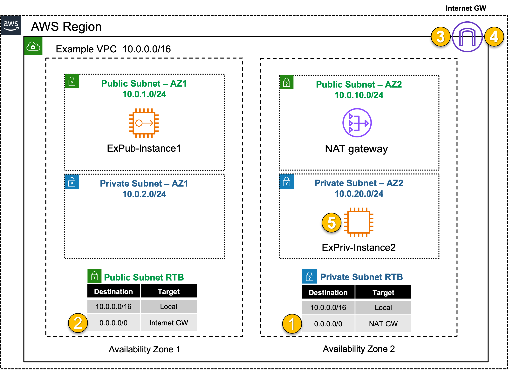

## **Private Outbound: Single VPC with NATGW** 
|                            |    |  
|----------------------------| ----
| **Goal**                   | Establish outbound only Internet access for EC2 Private instance.
| **Task**                   | Adjust the route table associations so ExPriv-Instance1 can reach the Internet.
| **Verify task completion** | Confirm outbound VPC connectivity from EC2 Instance via Ping to Internet from the EC2 instance

{} 
There are no security controls in this example. However, NATGW is a 1-way service, only allowing connectivity outbound.  While ExPriv-Instance2 can freely browse the Internet (outbound), no Internet hosts can connect to it (inbound).
{}

#### Summarized Steps (click to expand each for details)

1. Login to **ExPriv-Instance2** and verify it cannot access the Internet.

    {}

- **1.1:** In the **EC2 Console** go to the **Instances page** (menu on the left) and select the **ExPriv-Instance2** instance.
- **1.2:** click **Connect > EC2 serial console**.
    - **Copy the instance ID** as this will be the username and click connect.
  
- **1.3:** Login to the EC2 instance:
    - username: <<copied Instance ID from above>>
    - Password: **`FORTInet123!`**
- **1.4:** Run the command **`ping -c5 8.8.8.8`** to connect to public resources.
  - This **SHOULD NOT** work at this point.

   {}

2. Identify the relevant route table and add the proper route so 0.0.0.0/0 traffic is sent to **NATGW**.

    {}

- **2.1:** Navigate to the **VPC Console** and go to the **Subnets page** (menu on the left).
- **2.2:** Find the **Example-PrivateSubnet2** subnet.
- **2.3:** Select the **Route table tab** and click the actual route table name **rtb-.... / Example-PrivateRouteTable**.
  
- **2.4:** Select the **Example-PublicRouteTable** then select the **Routes tab** and click **Edit routes**.
  
- **2.5:** Add a default route (ie **0.0.0.0/0**) with a target of the **NAT Gateway** and click **Save changes**.
  

    {}

3. Test Internet connectivity from **ExPriv-Instance2** again.

    {}

- **3.1:** Go back to the EC2 serial console and rerun the command **`ping -c5 8.8.8.8`** to connect to public resources successfully. 

   {}

4. Let's dig deeper to understand how all of this works. 

    {}
	
- **4.1:** Run the command **`ifconfig ens5`** and take note of the instance IPv4 address. 
- **4.2:** Run the command **`curl ipinfo.io`**.

{}
The instance has the private IP 10.0.20.10/24, but is and seen as coming from a public IP. This is because a [**NAT Gateway**](https://docs.aws.amazon.com/vpc/latest/userguide/vpc-nat-gateway.html) is providing outbound access to the internet for this private EC2 instance.
{}

- **4.3:** In the **VPC Console** go to the **NAT gateways page** (menu on the left). 
- **4.4:** Find the **Example-NatGW** NAT Gateway and notice the public IP from the curl output matches the primary public IPv4 address assigned to NATGW. 
  - The NAT Gateway is deployed in the **Example-PublicSubnet2** subnet which has a route to the Internet through the [**AWS Internet Gateway (IGW)**](https://docs.aws.amazon.com/vpc/latest/userguide/VPC_Internet_Gateway.html).
  - These AWS Networking components are allowing private outbound access to work successfully for this instance.

    

- **4.5** Below is a step by step of the packet handling for the outbound web traffic from ExPriv-Instance2.

Hop | Component | Description | Packet |
---|---|---|---|
1 | ExPriv-Instance2 -> 0.0.0.0/0 NAT GW | ExPriv-Instance2 sends outbound traffic to the VPC router (it's default gw) which routes the traffic to NAT GW as configured in the Example-PrivateRouteTable. | **10.0.2.10:src-port -> x.x.x.x:80** |
2 | NAT GW -> 0.0.0.0/0 IGW | NAT GW changes the source IP to its own private IP and sends the traffic to VPC router. The VPC router routes traffic to IGW as configured in the Example-PublicRouteTable. | **y.y.y.y:src-port -> x.x.x.x:80** |
3 | IGW -> Internet | IGW changes the source IP to the associated EIP of NAT GW and routes the traffic to the internet. | **z.z.z.z:src-port -> x.x.x.x:80** |
4 | Internet -> IGW | IGW receives reply traffic, changes the source IP to the private IP of NAT GW, and sends the traffic to VPC router. The VPC router routes traffic to the NAT GW. | **x.x.x.x:80 -> y.y.y.y:dst-port** |
5 | NAT GW -> ExPriv-Instance2 | NAT GW changes the source IP back to the private IP of ExPriv-Instance2 and routes the traffic to the VPC router which delivers the traffic to ExPriv-Instance2. | **x.x.x.x:80 -> 10.0.2.10:dst-port** |

  

    {}

### Discussion Points
- NAT GW providing many to 1 NAT, for outbound only.
- No internal reachability via NATGW, so no inbound probes seen on any of the private instances.
- General best practice, though thoroughly insufficient for overall security principles.
  
**This concludes this task**
