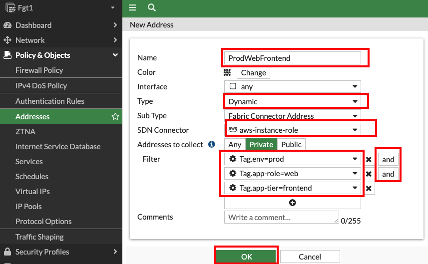
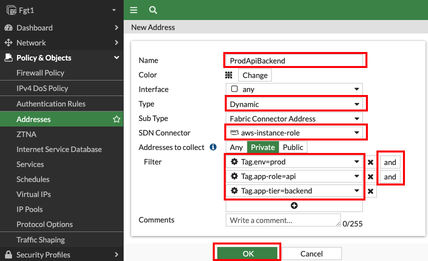
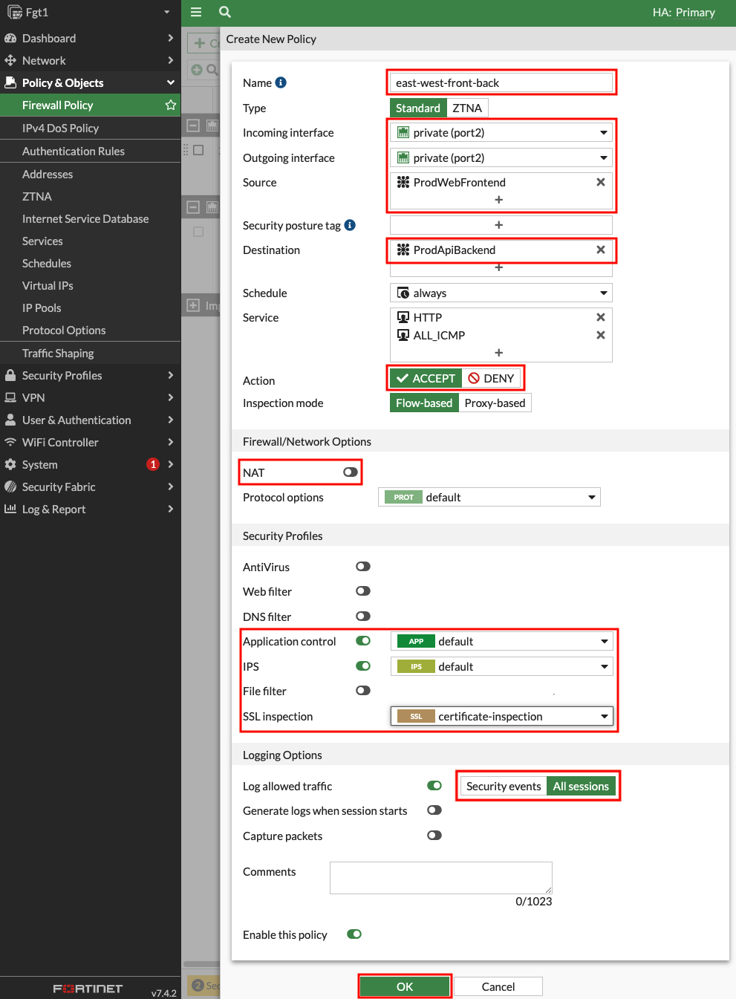
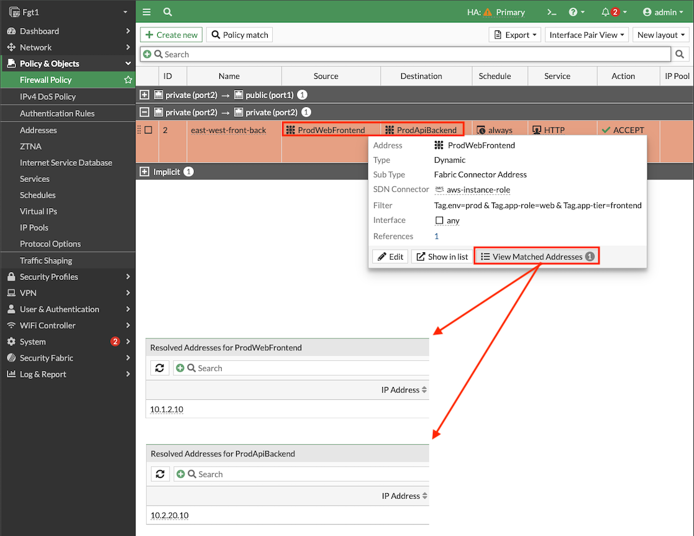
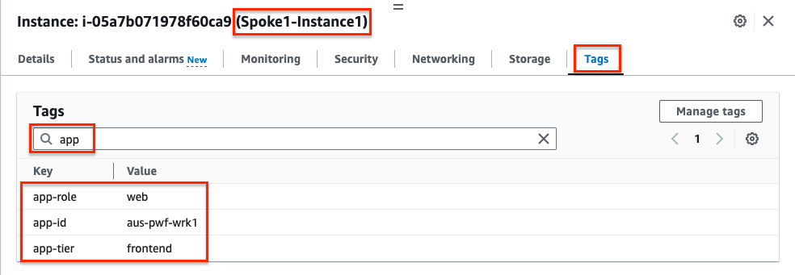
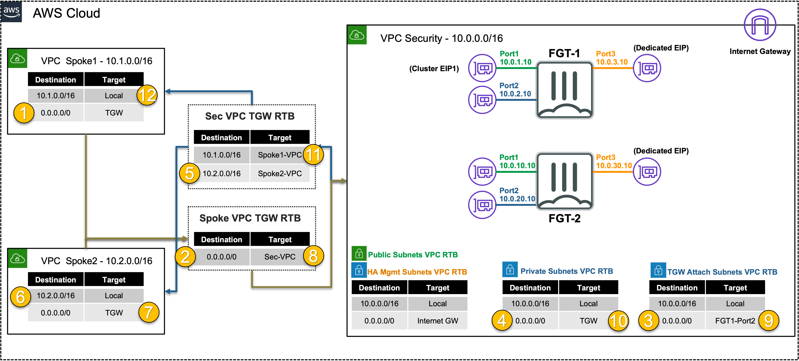

## **FortiGate Security VPC securing East/West Traffic**
|                            |    |  
|----------------------------| ----
| **Goal**                   | Utilize the provisioned Security VPC and Transit gateway architecture to provide security for East/West (Inter-VPC) flows with FortiGate NGFW.
| **Task**                   | Create FortiGate Policy objects and rules allowing East/West traffic to Acme Corp resources.
| **Verify task completion** | Confirm east/west VPC connectivity from EC2 Instance in _Spoke1_ via Ping to EC2 instance in _Spoke 2_

#### Summarized Steps (click to expand each for details)

1. Create Dynamic Address Objects.

    {}

- **1.1:** In the FortiGate GUI, navigate to **Policy & Objects > Addresses**, and click **Create new**.
- **1.2:** Create an address object with the **settings shown below** and click **OK**.

{}
Dynamic address objects allows creating address objects based on resource metadata such as VPC ID, Auto Scale Group, EKS Cluster or Pod, and even Tag Name + Value pairs applied to the resource. FortiOS is using AWS API calls behind the scenes such as ec2:DescribeInstances, eks:ListClusters, eks:DescribeCluster, etc to find running resources to match based on metadata and pull their IP address information. This is done on a frequent basis to keep the dynamic address object up to date automatically. **To learn more about all the public and private clouds this feature supports, check out our [**documentation**](https://docs.fortinet.com/document/fortigate/7.4.3/administration-guide/753961/public-and-private-sdn-connectors)**.
{}

Name | Type | Sub Type | SDN Connector | Address Type | Filter Value
---|---|---|---|---|---
ProdWebFrontend | Dynamic | Fabric Connector Address | aws-instance-role | Private | Tag.env=prod AND Tag.app-role=web AND Tag.app-tier=frontend
ProdApiBackend | Dynamic | Fabric Connector Address | aws-instance-role | Private | Tag.env=prod AND Tag.app-role=api AND Tag.app-tier=backend

    {}

2. Create Firewall Policy permitting East/West Traffic.
    
    {}

- **2.1:** Navigate to **Policy & Objects > Firewall Policy** and click **Create new**.
- **2.2:** Create a new policy with the **settings shown below** and click **OK** to allow east west traffic from Spoke1-Instance1 to Spoke2-Instance1.

- **2.3:** **Validate that the dynamic address objects** are automatically populated by hovering over both objects. In the popup menu, click **View Matched Addresses** button. ProdWebFrontend should have 10.1.2.10 and ProdApiBackend 10.2.20.10.

- **2.4:** 

    {}

3.  Verify connectivity from **Spoke1-Instance1**.

    {}

- **3.1:** Navigate to the **EC2 Console** and go to the **Instances page** (menu on the left).
- **3.2:** Find & Select the **Spoke1-Instance1** instance and select the **Tags tab** (detail pane below) to view the tags applied to the instance. Notice the tags seen here are the metadata that the FortiOS dynamic address objects are matching against. **Search** for **app** or **env** to see just the relevant tag key and value pairs.

    
	
- **3.3:** Find & Select the **Spoke1-Instance1** instance and click **Connect > EC2 serial console**. 
  - **Copy the instance ID** as this will be the username and click connect. 
- **3.4:** Login to the EC2 instance:
  - username: `<<copied Instance ID from above>>`
  - Password: **`FORTInet123!`**
- **3.5:** Run the commands **`ping -c5 10.2.20.10`** and **`curl 10.2.20.10`** to connect to private resources, successfully.
- **3.6:** Run the command **`ssh 10.2.20.10`** to be blocked by firewall policy.
 
    {}

4. Let's dig deeper to understand how all of this works.

    {}

- **4.1:** Navigate to **Log & Report > Forward Traffic** and you should logs for the traffic you generated. 
- **4.2:** **Double click** a log entry to view the **Log Details**.

{}
In the **Source and Destination sections** of the log, we see the no NAT is applied and traffic comes in and goes out port2 of the Primary FortiGate. This is because of the **VPC routes in the all VPCs (Spoke1, NGFW, and Spoke2) are working together with the Transit Gateway (TGW) and Transit Gateway route tables to route** the east/west traffic through the primary FortiGate. This is a [**centralized design**](https://docs.aws.amazon.com/vpc/latest/tgw/transit-gateway-appliance-scenario.html) that is also commonly called an appliance, inspection, or security VPC.

We can also see denied traffic that is matching the **Implicit Deny** firewall policy.  With adding granular firewall policies & objects including dynamic address objects and security profiles, you can securely control traffic as desired.
{}

- **4.3** Below is a step by step of the packet handling for the east/west web traffic from Spoke1-Instance1.

Hop | Component | Description | Packet |
---|---|---|---|
1 | Spoke1-Instance1 -> 0.0.0.0/0 TGW | Spoke1-Instance1 sends east/west traffic to the VPC router (its default gw) which routes traffic to TGW as configured in the Spoke1 VPC RTB. | **10.1.2.10:src-port -> 10.2.20.10:80** |
2 | Spoke1-TGW-Attachment -> 0.0.0.0/0 Sec-TGW-Attachment | Spoke1-TGW-attachment is associated to the Spoke VPC TGW RTB. This TGW RTB has a default route to Sec-TGW-Attachment, so traffic is forwarded there. | **10.1.2.10:src-port -> 10.2.20.10:80** |
3 | Sec-TGW-Attachment -> 0.0.0.0/0 FGT1-Port2 | Sec-TGW-Attachment is attached to the Security VPC TGW Attach Subnets which have a default route to primary FortiGate1 Port2, private interface. | **10.1.2.10:src-port -> 10.2.20.10:80** |
4 | FGT1-Port2 -> 0.0.0.0/0 TGW | FGT1 sends inspected & allowed traffic to the VPC router (10.0.0.0/8 static route out port2) via Port2, which routes traffic to the TGW as configured in the Private Subnet VPC RTB. | **10.1.2.10:src-port -> 10.2.20.10:80** |
5 | Sec-TGW-Attachment -> 10.2.0.0/16 Spoke2-TGW-Attachment | Sec-TGW-Attachment is associated to the Sec VPC TGW RTB. This TGW RTB has a route for Spoke2 VPC via Spoke2-TGW-Attachment, so traffic is forwarded there. | **10.1.2.10:src-port -> 10.2.20.10:80** |
6 | Spoke2-TGW-Attachment -> Spoke2-Instance1 | Spoke2-TGW-Attachment is attached to subnets in Spoke2 VPC which have a local VPC route to reach Spoke2-Instance1. | **10.1.2.10:src-port -> 10.2.20.10:80** |
7 | Spoke2-Instance1 -> 0.0.0.0/0 TGW | Spoke2-Instance1 sends reply traffic to the VPC router (its default gw) which routes traffic to TGW as configured in the Spoke1 VPC RTB. | **10.2.20.10:80 -> 10.1.2.10:dst-port** |
8 | Spoke2-TGW-Attachment -> 0.0.0.0/0 Sec-TGW-Attachment | Spoke2-TGW-attachment is associated to the Spoke VPC TGW RTB. This TGW RTB has a default route to Sec-TGW-Attachment, so traffic is forwarded there. | **10.2.20.10:80 -> 10.1.2.10:dst-port** |
9 | Sec-TGW-Attachment -> 0.0.0.0/0 FGT1-Port2 | Sec-TGW-Attachment is attached to the Security VPC TGW Attach Subnets which have a default route to primary FortiGate1 Port2, private interface. | **10.2.20.10:80 -> 10.1.2.10:dst-port** |
10 | FGT1-Port2 -> 0.0.0.0/0 TGW | FGT1 sends inspected & allowed traffic to the VPC router (10.0.0.0/8 static route out port2) via Port2, which routes traffic to the TGW as configured in the Private Subnet VPC RTB. | **10.2.20.10:80 -> 10.1.2.10:dst-port** |
11 | Sec-TGW-Attachment -> 10.1.0.0/16 Spoke1-TGW-Attachment | Sec-TGW-Attachment is associated to the Sec VPC TGW RTB. This TGW RTB has a route for Spoke1 VPC via Spoke1-TGW-Attachment, so traffic is forwarded there. | **10.2.20.10:80 -> 10.1.2.10:dst-port** |
12 | Spoke1-TGW-Attachment -> Spoke1-Instance1 | Spoke1-TGW-Attachment is attached to subnets in Spoke1 VPC which have a local VPC route to reach Spoke1-Instance1. | **10.2.20.10:80 -> 10.1.2.10:dst-port** |

  

    {}

**This concludes this task**
