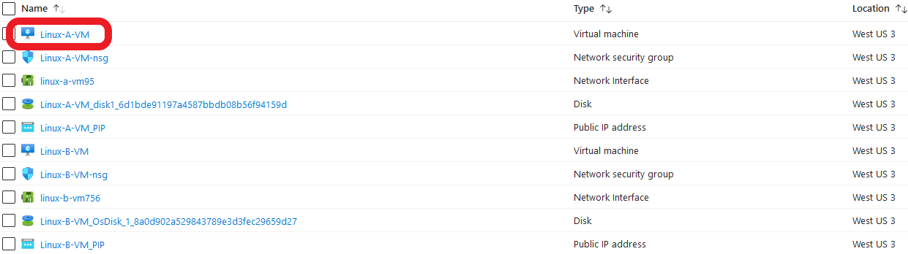
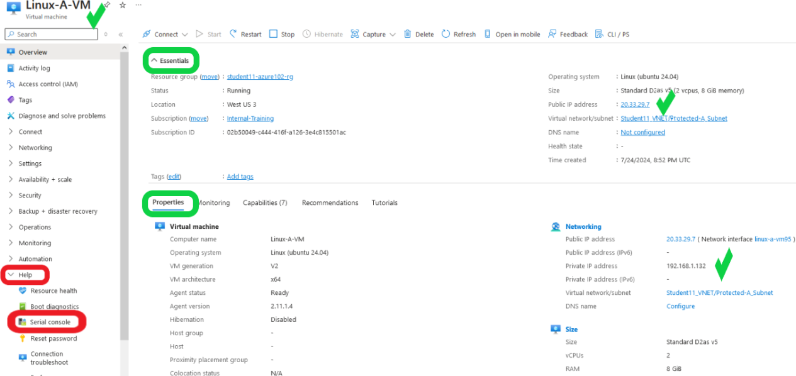
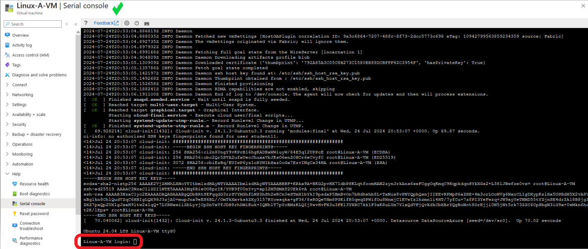
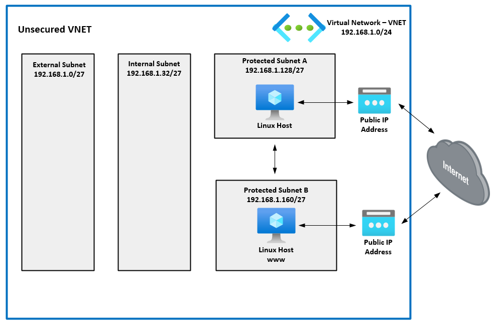

Now that you have deployed both Linux virtual machines, **Linux-A-VM** and **Linux-B-VM**, you are going to identify their assigned private and public IP (PIP) addresses, confirm which ports are open on each VM, and what access is available to and from their assigned subnets.

In the following steps 1-6, you will learn how to navigate and identify IP information for both VMs and login to each VM via the console.

 **Useful Hint: Access the serial console of both virthal machines in differant tabs to help simply navigation.**

- 1. Navigate into your Resource Group and right click on the virtual machine **Linux-A-VM**.  Select **Open Link in New Tab**  
  
    
You will see the **Linux-A-VM** Overview page in a new tab.

- 2. Under the **Essentials** and **Properties** sections, right hand side, identify the assigned private and public IP of **Linux-A_VM**
        - Navigate to the bottom left of the screen, expand the **Help** menu, and select **Serial console**.

You will be redirected to the **Linux-A-VM | Serial Console** screen.

- 3. Login to the **Linux-A-VM** console using the credentials you used when creating the **Linux-A-VM**.

- 4. Return to the **studentxx-azure102-rg** tab and right click on the virtual machine **Linux-B-VM**.  Select **Open Link in New Tab**  

You will see the **Linux-B-VM** Overview page in a new tab.

- 5. Under the **Essentials** and **Properties** sections, right hand side, identify the assigned private and public IP of **Linux-B-VM**
        - Navigate to the bottom left of the screen, expand the **Help** menu, and select **Serial console**.

You will be redirected to the **Linux-B-VM | Serial Console** screen.

- 6. Login to the **Linux-B-VM** console using the credentials you used when creating **Linux-B-VM**.

<ins>The VNET security policy for company ABC is as follows:</ins>
- **Linux-A-VM** will be the management server.  Per company ABC security policy, it should only have SSH and PING access to **Linux-B-VM** and HTTP/HTTPS access to the Internet.  There should also be SSH access to **Linux-A-VM** from the Internet.

- **Linux-B-VM** is the www server.  Only HTTP services from the Internet should be allowed.  It will also have HTTP and HTTPS access to the Internet and only PING access to **Linux-A-VM**.

The goals of the following steps seven and eight, are to note what service ports are open and listening on each VM, what access does each VM have accross subnets, and what services to and from the Internet each VM has exposed and access to.  
With this information, we can implement company ABC's VNET security policies when securing the VNET in **Chapter Four: Securing the VNET**.  

**Make sure to configure **Linux-B-VM** first - Step seven**
- 7. From the **Linux-B-VM** CLI:
        - a. Ping www.yahoo.com and confirm DNS and ICMP access to the internet:  "**ping www.yahoo.com**" (CTRL+c to stop ping)
        - Confirm port 80 access to the Internet:  "**wget www.fortinet.com**".  (Confirm "200 OK" response)
        - Confirm port 443 access to the Internet and the public IP assigned to **Linux-B-VM**: "**curl https://ipinfo.io/ip**".  (Confirm against what the Azure portal listed in step five above)
        - Check for Ubuntu updates and install them:  
                - "**sudo apt update**"
                - "**sudo apt upgrade**" and select "**Y**".
                - Type "**clear**" after the updates have finished.
        - Install the web service **NGINX**:  "**sudo apt install nginx**" and select "**Y**".
     - Checking access to **Linux-A-VM**:
        - Ping the private IP of **Linux-A-VM** and confirm replies.  (See step two above for IP)
        - Install **NMAP**:  "**sudo apt install nmap**" and select "**Y**"
        - Scan open ports on **Linux-A-VM**:  "**nmap -F 192.168.1.xxx**"  (See step two above for IP)
        Note the open port(s) on **Linux-A-VM**
     - Confirm SSH access to **Linux-A-VM**:
         - Login via SSH:  **ssh studentxx@192.168.1.xxx**"
         - Run "**sudo ss -ltn**" to confirm the same open ports that NMAP reported
         - Type **exit** to disconnect from **Linux-A-VM**

- 8. From the **Linux-A-VM** CLI:
        - Ping "**www.yahoo.com**" and confirm replies.  (CTRL+c to stop ping)
        - Confirm port 80 access to the Internet:  "**wget www.fortinet.com**"
        - Confirm port 443 access to the Internet and the public IP assigned to **Linux-A-VM**: "**curl https://ipinfo.io/ip**"  (Confirm against what the Azure portal listed in step two above)
        - Check for Ubuntu updates and install them:  
                - "**sudo apt update**"
                - "**sudo apt upgrade**" and select "**Y**".
                - Type "**clear**" after the updates have finished.
        - Ping the private IP of **Linux-B-VM** and confirm replies.  (See step five above for IP)
        - Install **NMAP**:  "**sudo apt install nmap**"
        - Scan open ports on **Linux-B-VM**:  "**nmap -F 192.168.1.xxx**"  (Note step five above for IP)
        Note the open port(s) on **Linux-B-VM**.
     - Confirm SSH access to **Linux-B-VM**:
         - Login via SSH:  **ssh studentxx@192.168.1.xxx**"
         - Run "**sudo ss -ltn**" to confirm the same open ports that NMAP reported.
         - Type **exit** to disconnect from **Linux-B-VM**.

The following diagram is a visual representation of your current VNET and VM deployment.

What do steps seven and eight, above, tell you about access to/from the Internet to both Linux VMs?  Does this match company ABC's VNET security policy?

What do steps seven and eight, above, tell you about access between each Linux VM in different subnets?  Does this match company ABC's VNET security policy?

**Continue to Chapter Five: Securing the VNET**
