Now that you have confirmed traffic from both Linux VMs is being routed to the ForitGate, you will create policies that will accomplish the security requirements requested by company ABC.
To meet these requirements, the following access needs to be setup for each Linux VM.

**Linux-A-VM** is the management server and should have the following access:
- SSH and PING access to **Linux-B-VM**
- HTTP and HTTPS access to the Internet
- SSH access to **Linux-A-VM** from the Internet

**Linux-B-VM** is the www server and should have the following access:
- HTTP service from the Internet
- HTTP and HTTPS access to the Internet
- PING access to **Linux-A-VM**

In the following steps, you will create an address object, a VIP, and a Firewall Policy for **Linux-A-VM** and then repeat east step to create similar configurations for **Linux-B-VM**.

- 1. From the FotiGate GUI, navigate to **Policy & Objects**, **Addresses**, and click "**+ Create new**".  
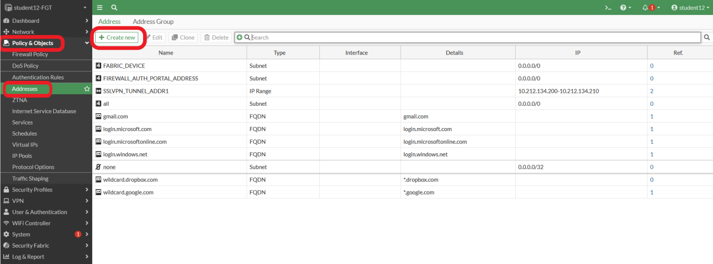

- 2. Enter the following:
        - **Name**:  "**Linux-A-VM**"
        - **Interface**:  "**port2**"
        - **Type**:  "**Subnet**"
        - **IP/Netmask**:  "**192.168.1.132/32**"

Click **OK** and confirm the new address for **Linux-A-VM** is displayed.
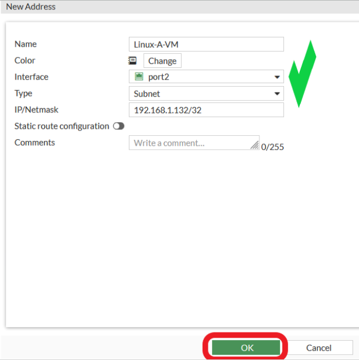

- 3. Repeat step two above and create an address for **Linux-B-VM**.  Your **Address** screen should have both Linux VMs listed.
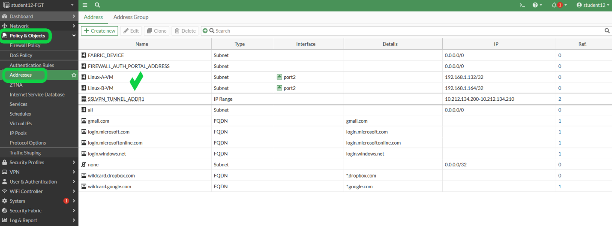

- 4. Navigate to **Policy & Objects**, **Virtual IPs**, and click "**+ Create new**".  
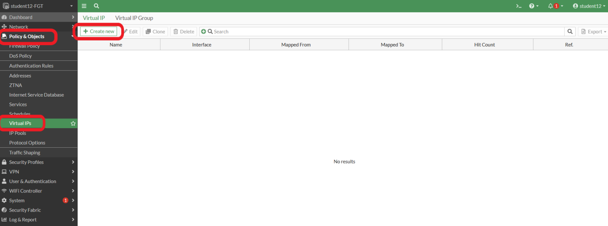

- 5. Enter the following:
        - **Name**:  "**Linux-A-VM_VIP**"
        - **Interface**:  "**port1**"
        - **External IP address/range**:  "**192.168.1.4**"
        - **Map to IPv4 address/range**:  "**192.168.1.132**"
        - **Port Forwarding**:  "**Enable**"
        - **External service port**:  "**22**"
        - **Map to IPv4 port**: "**22**"

Click **OK** and confirm the new VIP for **Linux-A-VM** is displayed.
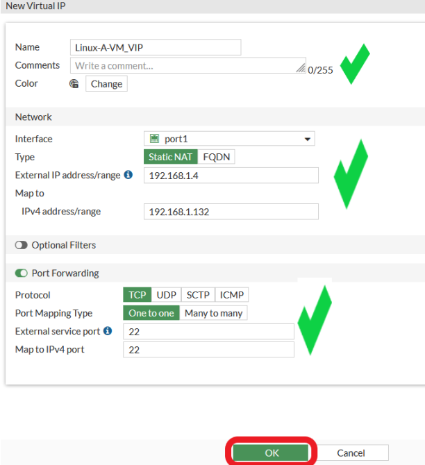

- 6. Repeat step five above and create a VIP for **Linux-B-VM**.  HTTP should be the service port.  Your **Virtual IPs** screen should have two entries.
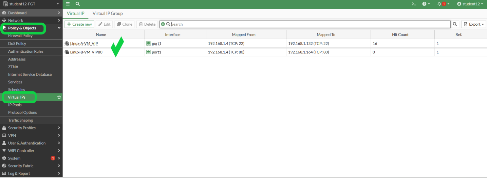

- 7. Navigate to **Policy & Objects**, **Firewall Policy**, and click "**+ Create new**".
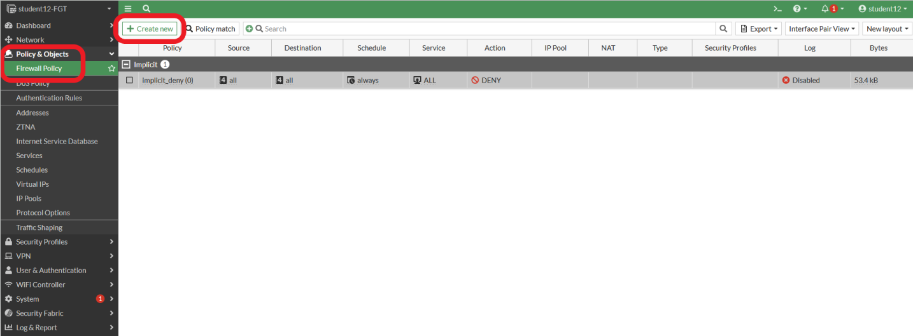

- 8. Enter the following:
        - **Name**:  "**Internet access to Linux-A-VM**"
        - **Incoming interface**:  "**port1**"
        - **Outgoind interface**:  "**port2**"
        - **Source**:  "**all**"
        - **Destination:**:  "**Linux-A-VM_VIP**"
        - **Service**:  "**SSH**"
        - **NAT**:  **Toggle to disabled**

Click **OK** and confirm the new policy for **Linux-A-VM** is displayed.
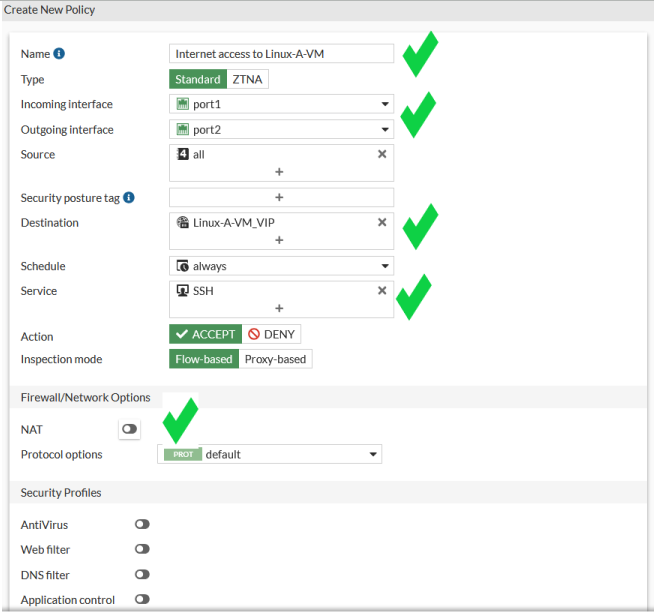
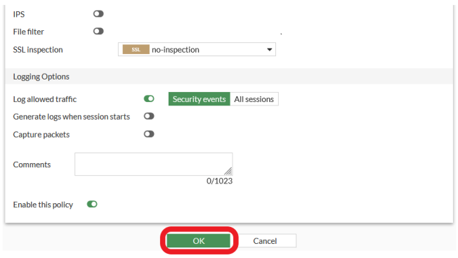
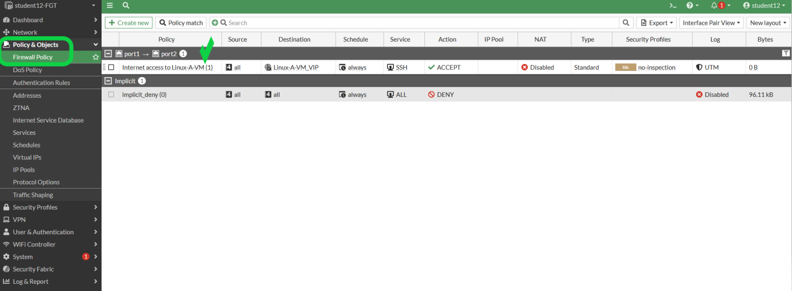

- 9.  Enter the following to create a policy to allow SSH and PING access to **Linux-B-VM**.
        - **Name**:  "**SSH & PING access to Linux-B-VM**"
        - **Incoming interface**:  "**port2**"
        - **Outgoind interface**:  "**port2**"
        - **Source**:  "**Linux-A-VM**"
        - **Destination:**:  "**Linux-B-VM**"
        - **Service**:  "**SSH PING**"
        - **NAT**:  **Toggle to disabled**

Click **OK** and confirm the new policy is displayed.
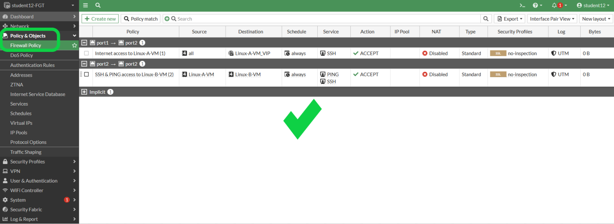

- 10. Repeat and modify step nine above to finishing adding the required policies for **Linux-A-VM**, HTTP and HTTPS access to the Internet, and the following policies needed for **Linux-B-VM**.

**Linux-B-VM** is the www server and should have the following access:
- HTTP service from the Internet
- HTTP and HTTPS access to the Internet
- PING access to **Linux-A-VM**

- 11. When you are finished adding all the policies for both Linux-VMs, your **Firewall Policy** page should look similar to the following:
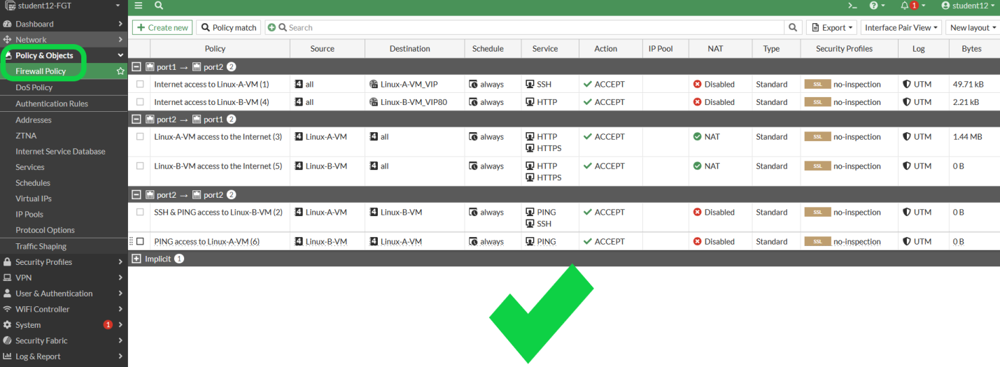
 
 - 12. 