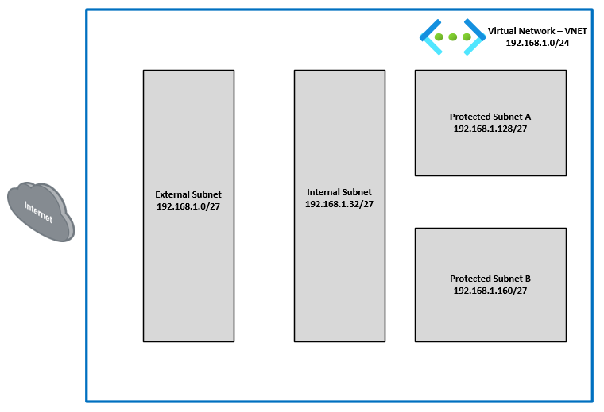

Our first step is going to be the creation of a new VNET (Virtual Network) in the training Resource Group that you have been assigned.
- **Creation Steps**
    - 1. Navigate into your Resource Group and click on the **+ Create** located at the top left of the tool bar.
  

You will be redirected to the Azure Marketplace.

In the Marketplace search bar, enter **Virtual Network** and then enter.  Navigate to the **Virtual Network** offering from Microsoft and select **Create** and **Virtual network**.

You will be redirected to the **Create virtual network** template.

- Under the **Basics** tab, the **Subscription** and **Resource Groups** should already be filled in with your assigned info.  If not, see the screen shot below for details.
- Under **Instance details**, enter the **Virtual network name**: "**Studentxx_VNET**".   
    - Replace "**xx**" with your assigned student number.
- Confirm the **Region** is **(US) West US 3**
- Select **Next**.

- On the **Security** tab, make sure none of the services are selected and click **Next**.
Feel free to read through the available services that can be enabled.

- On the **IP address** tab, edit the default address space to "**192.168.1.0/24**".
- Select the edit button (Red) next to the "default" subnet and, in the new window to the right, update the following info:  
    - **Name**:  "**External_Subnet**"
    - **Starting address**:  "**192.168.1.0**"
    - **Size**: "**/27**"
- Select **Save** 

- Select **+ Add a subnet** (see red below), and add the following info:
    - **Name**:  "**Internal_Subnet**"
    - **Starting address**:  "**192.168.1.32**"
    - **Size**:  "**/27**"
    - Select **Add**

- Continue to **+ Add a subnet** for "**Protected-A_Subnet**" and "**Protected-B_Subnet**" with their respective subnets.  See the diagram below for **IP address range** assignments.  Select **Next**.

- on the **Tags** tab, select **Next**.  Nothing to enter here.

- On the "Review + create** tab, confirm the template summary and select **create**.

- When the deployment is complete, you will get a **Your deployement is complete** notice.
    - Confirm your deployment has completed and under **Resource group** select the "**studentxx-azure102-rg**" link.  See red section below.

- Your screen should return you to your respective resource group with the new virtual network listed.  Feel free to click on the new virtual network and look around.

- You have just created an **Azure virtual network (VNET)**.  The diagram below is a visual representation of your new VNET.

- Continue to **Task 2 - Creating a Linux VM**.

