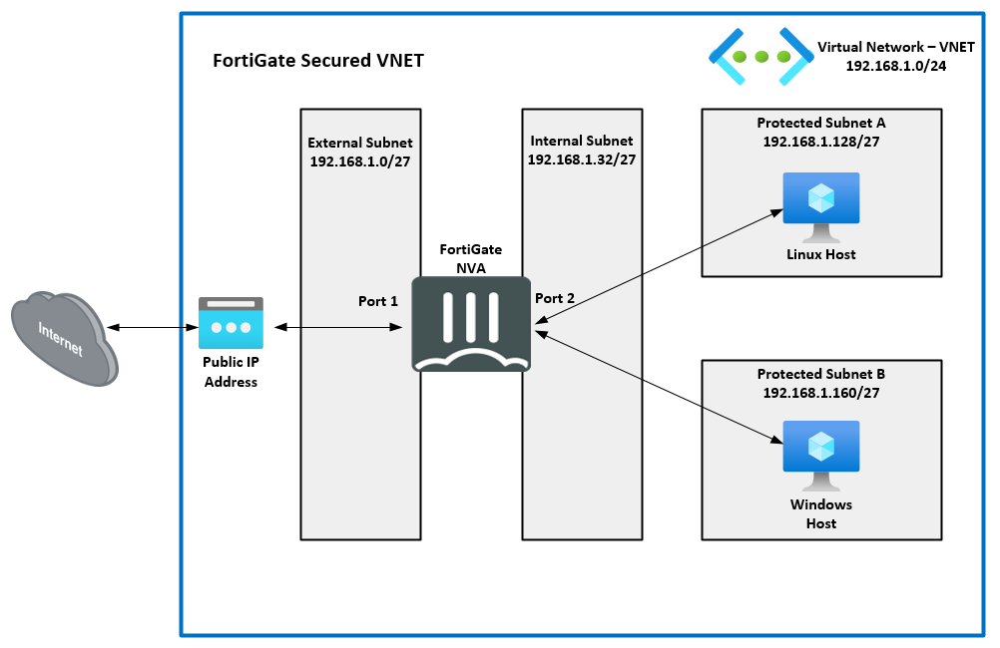

In Task Three, you will confirm the Linux VMs are using the FortiGate NVA as their default route and that all traffic to/from the Linux VMs is going through the FortiGate.

- 1. Navigate into your **Resource Group** and open, in seperate tabs, the **FortiGate** GUI, the **Linux-A-VM** console, and the **Linux-B-VM** console.  

- 2. From the **Linux-A-VM** console, run the following:
    - "**ping www.yahoo.com**"
    - "**ping 192.168.1.164**"

Did you get a response from either?  Why not?

- 3. From the **Linux-B-VM** console, run the following:
    - "**ping www.yahoo.com**"
    - "**ping 192.168.1.132**"

Did you get a response from either?  Why not?

- 4. From the Fortinet GUI, open a console window, and enter the following command:
    - "**diagnose sniffer packet port2 'icmp'**"

- 5. Run steps two and three again.

Do you see the traffic being reported in the ForiGate console?
Is the traffic from both Linux VMs being routed to the FortiGate via port2?

- 6. The diagram below is a visual representation of your VNET with the Linux VMs traffic flow via the FortiGate NVA.  This is now the active flow of taffic based on the UDRs in the Route Table.

**Continue to Chapter 5 - Task 4: Configure FortiGate Polices**

