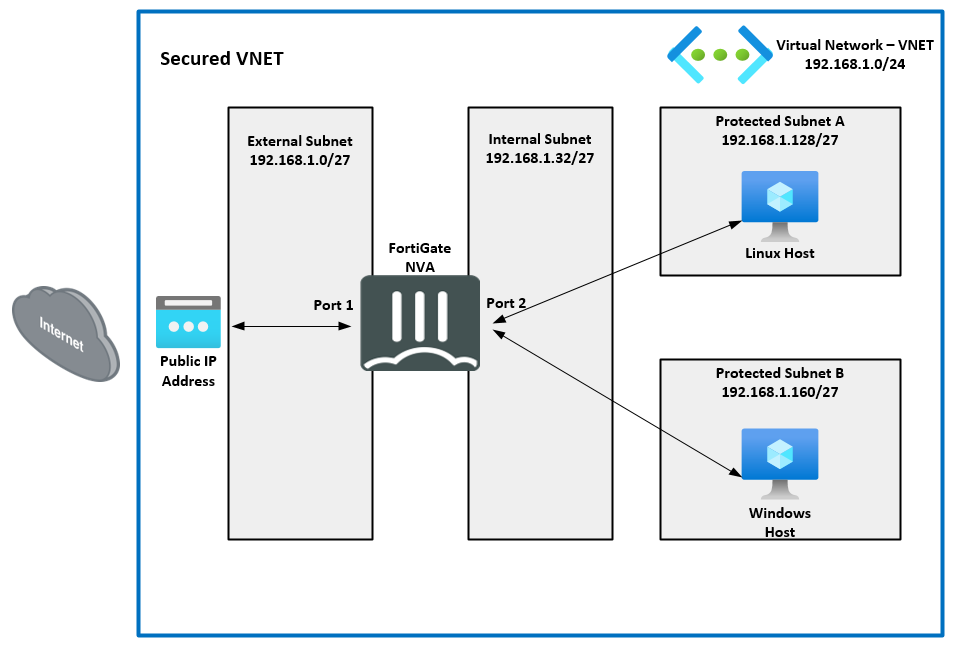

## Welcome to Fortinet XPERTS USA Summit 2024

In this course you will learn how to deploy a FortiGate NGFW and secure an Azure virtual network (VNET) to meet the security requirements of Company ABC as they move server workloads to Azure.  This course will start with understanding key services and terminology used in Azure when deploying public and private facing services in the public cloud.  The course continues with the student deploying a FortiGate to secure the VNET and the hosted services.

## Course Goals
- Learn key Azure services and terms
- Deploy and configure a Virtual Network (VNET)
- Deploy server VMs in a VNET
- Deploy and configure a FortiGate network virtual appliance (NVA)
- Deploy a route table and create User Define Routes (UDR)
- Secure the VNET and hosted services utilizing FortiGate polices

**Continue to Chapter 1: Learning Objectives**